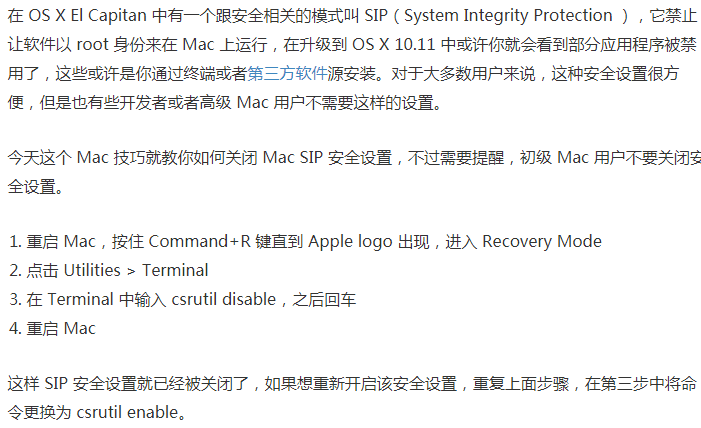
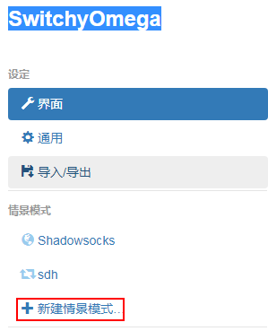
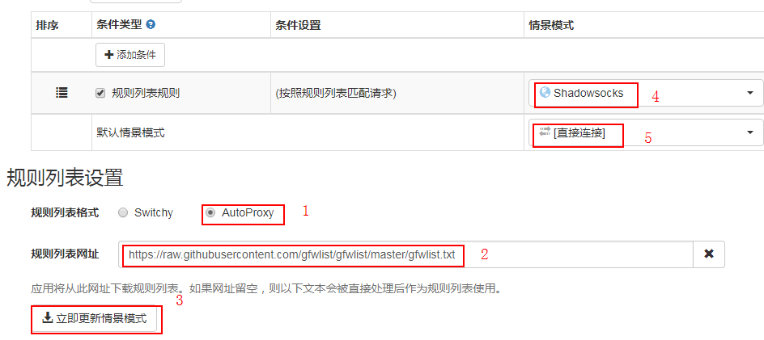
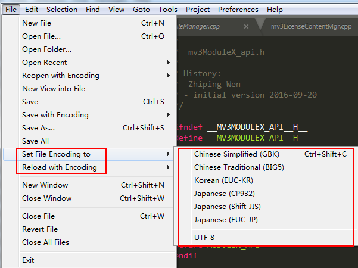
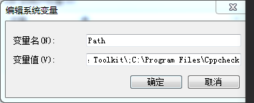
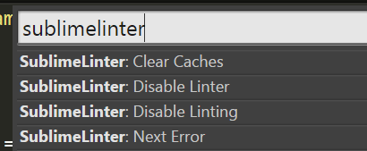

# 【android学习资料】
1、别人在github分享整理的android资料
https://github.com/lizhangqu/CoreLink

2、android源码在线浏览网站
http://androidxref.com  android的各个版本，可用于搜索源文件

http://www.grepcode.com/  android各个版本java源码查看

3、android编译要求和教程
https://source.android.com/source/requirements
#【macbook】
## 1.翻墙
### 1.1 mac shadowsocks软件设置
https://fanach.github.io/post/ss-macos/
### 1.2 shadowsocks关于终端设置
https://blog.fazero.me/2015/08/31/%E5%88%A9%E7%94%A8proxychains%E5%9C%A8%E7%BB%88%E7%AB%AF%E4%BD%BF%E7%94%A8socks5%E4%BB%A3%E7%90%86/

http://blog.csdn.net/gengxuelei/article/details/52514603
### 1.2.1 关闭SIP保护
**原因:**
 &ensp;&ensp;&ensp;由于Mac的sip保护，导致了Proxychains无法正常工作，残念。(OS X 10.11版本以上都GG)

**关闭操作:**

## 2.常用触摸板手势

# 【ubuntu】
## 1.shadowsocks环境搭建
http://blog.csdn.net/szsteel1/article/details/54773544?utm_medium=referral&utm_source=itdadao
## 2.代理设置
https://github.com/feixiao/ubuntu/blob/master/proxy.md
## 3.适合ubuntu环境的笔记本
https://certification.ubuntu.com/certification/desktop/

#【chrome浏览器】
## 1.自动切换代理上网

规则列表网址:https://raw.githubusercontent.com/gfwlist/gfwlist/master/gfwlist.txt

#【sublime text3】
## 插件安装
### 1、安装插件下载器 
Ctrl+Shift+P调出控制面板，输入install，点击Package Control: Install Package，就可以查找并安装各种插件了

### 2、c++相关插件
#### 2.1 解决中文乱码问题 ConvertToUTF8
a.Ctrl+Shift+P调出控制面板，输入install，点击Package Control: Install Package等装好 
b.输入ConvertToUTF8等装好 
c.装成功后，在菜单下会出现如下新增的子菜单

### 3.查看和删除已经安装好的插件
a.Ctrl+Shift+P 
b.输入remove packages,就可以看到哪些已经安装好的插件可以删除

### 3. 整理美化编写的C++代码
a.a.Ctrl+Shift+P调出控制面板，输入install，点击Package Control: Install Package等装好 
b.输入SublimeAStyleFormatter等装好 
c.快捷键Ctrl+Alt+F,针对整个文件整理

### 4.C++静态代码检测
a.安装 cppcheck插件 
插件网址:http://cppcheck.sourceforge.net ,下载好后安装,把安装目录添加到系统环境Path变量中

b.然后通过插件管理器分别安装SublimeLinter和SublimeLinter-cppcheck 
Ctrl+Shift+P调出控制面板输入SublimeLinter，激活Linter和Linting 
如图是激活状态: 

c.使用:通过菜单Tools -> SublimeLinter -> Mark Style，选择No Column Highlights Line。

## 快捷键功能
### 网站
https://www.zhihu.com/question/19976788
### 1、格式化粘贴 Shift+Ctrl+V
Ctrl+W：关闭当前打开文件 
Ctrl+D：选择单词，重复可增加选择下一个相同的单词 
Ctrl+N：新建窗口 
Ctrl+K+B：开关侧栏 
Ctrl+Shift+M：选中当前括号内容，重复可选着括号本身 
Ctrl+/：注释当前行 
F11：全屏 
Alt+F3：选择所有相同的词 
Alt+Shift+数字：分屏显示 
