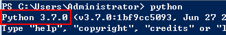
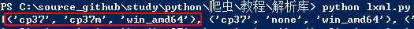
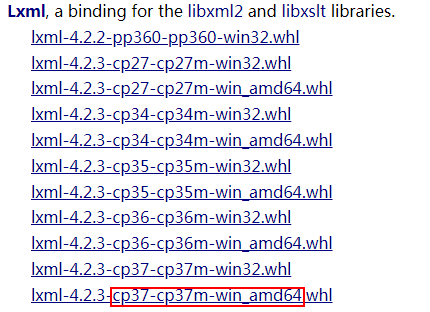
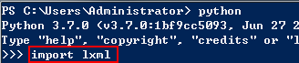
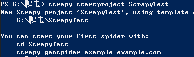

#运行脚本
##win32
1. 先找到python安装的路径
1. 环境变量的path添加python的环境路径
1. python xxx.py执行

#安装
##requests
这个是请求库
安装方法:
1. 到git下载源码zip源码，https://github.com/requests/requests,然后下载安装压缩包
1. 解压到python目录下，cmd 进入py D:\python\requests-master
1. 输入命令：python setup.py install 回车即可
1. 创建一个py文件,复制下面内容到文件,运行成功有返回内容
import urllib.request
import requests
r = requests.get('http://httpbin.org/get')
print(r.text)
##lxml
1.pip3 install lxml 没报错,则安装成功
2.如果报libxml2没找到错误,则先

查看python版本
3.执行下面代码,获取截图红框所示
> #AMD64
> import pip._internal
> print(pip._internal.pep425tags.get_supported())

4.到https://www.lfd.uci.edu/~gohlke/pythonlibs/#lxml 下载对应的lxml版本

4.pip3 install lxml-4.2.3-cp37-cp37m-win_amd64.whl
5. 验证是否安装lxml成功

没报错就说明安装成功

##Scrapyd相关安装
学习url：http://scrapy-chs.readthedocs.io/zh_CN/0.24/intro/overview.html
###pyOpenSSL
1. 到https://pypi.org/project/pyOpenSSL/#files下载whl
2.pip3 install XXX.whl

###Twisted
1. 到https://www.lfd.uci.edu/~gohlke/pythonlibs/#twisted下载对应的whl
2. pip3 install XXX.whl

#代理

作用:通过代理的IP去访问服务器,这样服务器就不知道原来的IP

#http基本库的使用
##urllib
官网:https://docs.python.org/3/library/urllib.html

#Scrapy架构

#创建项目
1. 在cmd命令行下输入：scrapy startproject ScrapyTest, 如果出现如下则表示成功
