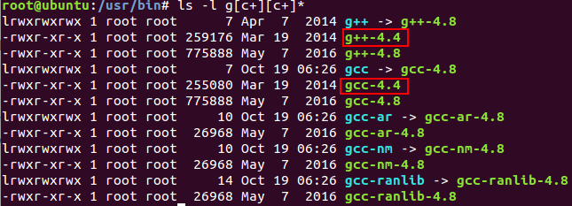
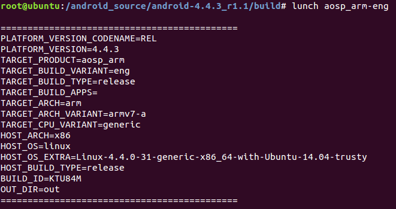
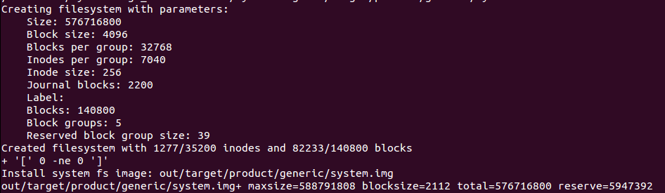
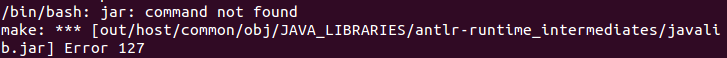

在下载android前，要安装git

proxychains repo init -u https://android.googlesource.com/platform/manifest -b android-4.4.3_r1.1

环境搭建：http://www.cnblogs.com/QUSIR/p/6179495.html
http://862123204-qq-com.iteye.com/blog/1992973

# java安装
**说明:** 由于很多系统不支持使用OpenJDK，因此在ubuntu下会需要安装Oracle JDK。而Oracle JDK的安装貌似没有提供apt方式，因此安装Oracle JDK的方式相对麻烦一些，我经常安装，为了方便别人同时方便自己查看，把它记下来。

1. 区分32位还是64位操作系统
> $uname -a

2. 卸载OpenJDK
> 先执行如下命令看是否安装了OpenJDK，如果已经安装，会显示java的信息。
$java -version

> 如果安装了OpenJDK，可用如下方法全部卸载：
$sudo apt-get purge openjdk-\*

3. 下载Oracle JDK版本
> 进入 http://www.oracle.com/technetwork/java/javasebusiness/downloads/java-archive-downloads-javase6-419409.html，选择"Java SE Development Kit 6u45"，然后在新打开的页面点选接受"Accept License Agreement". 接受之后，选择" jdk-6u45-linux-x64.bin"即可进行下载。如果你没有登录，系统会先转到登录页面，输入你在Oracle网站注册的用户名和密码即可。

4. 安装Oracle JDK
> - (1) 创建java目录
$ sudo mkdir -p /usr/local/java
将你下载的jdk-6u45-linux-x64.bin拷贝至/usr/local/java目录
$ cd /usr/local/java
$ sudo cp /home/dennis/Downloads/jdk-6u45-linux-x64.bin .

> - (2) 解压bin文件
$ sudo chmod +x jdk-6u45-linux-x64.bin
$ sudo ./jdk-6u45-linux-x64.bin
$ sudo rm -rf jdk-6u45-linux-x64.bin

5. 配置Orache JDK
> - (1) 配置JAVA_HOME和PATH环境变量
sudo vi /etc/profile
在该文件的末尾加上如下部分：
JAVA_HOME=/usr/local/java/jdk1.6.0_45
PATH=$PATH:$HOME/bin:$JAVA_HOME/bin
export JAVA_HOME
export PATH

> 让配置生效:source /etc/profile

> - (2) 配置ubuntu的JDK和JRE的位置
> sudo update-alternatives --install "/usr/bin/java"
> "java" "/usr/local/java/jdk1.6.0_45/bin/java" 1
$ sudo update-alternatives --install "/usr/bin/javac" "javac" "/usr/local/java/jdk1.6.0_45/bin/javac" 1
$ sudo update-alternatives --install "/usr/bin/javaws" "javaws" "/usr/local/java/jdk1.6.0_45/bin/javaws" 1

> - (3) 配置Oracle为系统默认JDK/JRE
$ sudo update-alternatives --set java /usr/local/java/jdk1.6.0_45/bin/java
$ sudo update-alternatives --set javac /usr/local/java/jdk1.6.0_45/bin/javac
$ sudo update-alternatives --set javaws /usr/local/java/jdk1.6.0_45/bin/javaws

> 配置完成后，执行如下命令使其立即生效。
. /etc/profile
再次执行"java -version"显示如下：
dennis@dubuntu1404:~$ java -version
java version "1.6.0_45"
Java(TM) SE Runtime Environment (build 1.6.0_45-b06)
Java HotSpot(TM) 64-Bit Server VM (build 20.45-b01, mixed mode)

# make安装
##安装make-3.81

- 解压make-3.81.tar.bz2

> tar -vxf make-3.81.tar.bz2

- 进入make-3.81目录并执行./configure

> cd ./make-3.81
./configure

- 执行玩后make-3.81目录会多出一个build.sh文件，执行build.sh即可得到make文件。

> ./build.sh

- 验证编译出来的make是不是我们想要的3.81版本
> make -v

- 替换系统原有的make
> cd /usr/bin/
sudo mv ./make ./make.backup
mv ~/make-3.81/make ./

# gcc
- 查看当前gcc版本
> gcc --version  

- 安装
> sudo apt-get install gcc-4.4
> sudo apt-get install g++-4.4

- 装完后进入到/usr/bin目录下
> ls -l g[c+][c+]*

- 把gcc改为软链接到gcc4.4
> 先创建目录gcc_g++,把原先的gcc和g++移动到gcc_g++

> ln -s gcc-4.4 gcc
> ln -s g++-4.4 g++

- 再查看gcc和g++版本号：
> gcc --version
> g++ --version

- 后续问题：
>提示bits/predefs.h：没有那个文件或目录 错误的
输入sudo apt-get install gcc-multilib 即可
g++ selected multilib '32' not installed
sudo apt-get install g++-4.4-multilib

# android编译

> make -j8

编译成功的最后截图

# 运行android模拟器
>root@ubuntu:/android_source/android-4.4.3_r1.1# emulator
emulator: command not found

> **解决方法**
root@ubuntu:/android_source/android-4.4.3_r1.1# cd out/host/linux-x86/bin/
root@ubuntu:/android_source/android-4.4.3_r1.1/out/host/linux-x86/bin# ./emulator

android 编译错误
/bin/bash: jar: command not found

