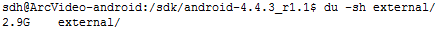
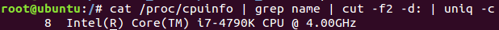
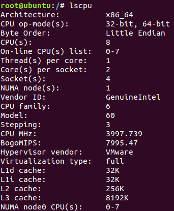

# 目录
- 显示目录大小
du -sh external

<<<<<<< HEAD
##

# 压缩
## zip
- 优缺点：跨平台，压缩率不大
- 参数解释
  -r    递归
  -x    忽略,但是目前只能忽略文件，不能忽略文件夹
- 忽略文件
zip -x 文件名 -r 压缩文件名.zip 保存文件路径

2.8G
tar 753m
zip 915m

## tar
- 压缩当前文件夹下非隐藏文件的文件
tar czvf test.tar.gz *
 压缩当前文件夹下隐藏文件排除两个隐藏文件夹"."和“..”
tar czvf test.tar.gz  .[!.]*
压缩当前文件夹下所用文件，包括隐藏文件
tar czvf test.tar.gz    .[!.]*    *

# 查看系统参数
- 查看cpu型号
> # cat /proc/cpuinfo | grep name | cut -f2 -d: | uniq -c

> 表示8核

- 查看ubuntu运行位数
> getconf LONG_BIT
> 显示结果:64

- 查看cpu信息概要

=======

# 文件
- 拷贝
> 拷贝srcDir下所有的文件，包括隐藏文件等
> cp -r srcDir/*    dstDir
>>>>>>> 42ea2f7a63d614ef5df61365e2652962a120eaaa
