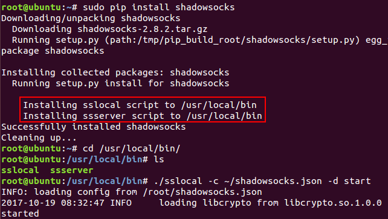

- 开启当前用户命令行提示符
1.  vim ~/.bashrc 
2.  #force_color_prompt=yes 改为 force_color_prompt=yes
3.  关闭终端

----
# shadowsocks
- 1、安装shadowsocks
sudo pip install shadowsocks

- 2、配置shadowsocks
在自己的home目录下新建配置文件shadowsocks.json

      {
          "server":"144.168.63.135",
          "server_port":443,
          "local_address":"127.0.0.1",
          "local_port":1080,
          "password":"YmQxOWQyZW",
          "timeout":300,
          "method":"aes-256-cfb",
          "fast_open":false
      }

- 3、shadowsocks客户端的启用
    sslocal -c ~/shadowsocks.json -d start
    上面可能提示sslocal没找到，是因为没配置到命令行搜索环境中;
    要找到安装在哪，再次调用 sudo pip install shadowsocks
    
----
# proxychains
- 1、安装proxychains
>    sudo apt install proxychains

- 2、配置proxychains
> 编辑/etc/proxychains.conf，最下面有一行socks4 127.0.0.1 9050，
> 把这一行注释掉，添加一行socks5 127.0.0.1 1080

- 3、测试
> proxychains curl www.google.com
> 如果成功了,会有许多输出

- 4、使用
> 用命令行启动软件，在前面加上proxychains，如：
**proxychains firefox**
使用shadowsocks+proxychains代理打开新的firefox实现浏览器翻墙。
也可以通过输入proxychains bash建立一个新的shell，基于这个shell运行的所有命令都将使用代理。
