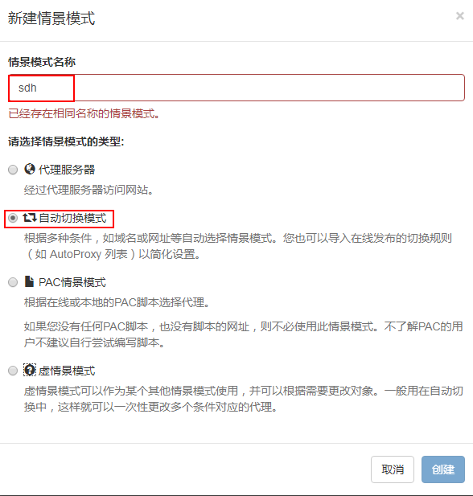

#【android学习资料】
1、别人在github分享整理的android资料
https://github.com/lizhangqu/CoreLink

2、android源码在线浏览网站
http://androidxref.com  android的各个版本，可用于搜索源文件

http://www.grepcode.com/  android各个版本java源码查看

#【macbook】
## 1.翻墙
### 1.1shadowsocks软件设置
https://fanach.github.io/post/ss-macos/
### 1.2shadowsocks关于终端设置
https://blog.fazero.me/2015/08/31/%E5%88%A9%E7%94%A8proxychains%E5%9C%A8%E7%BB%88%E7%AB%AF%E4%BD%BF%E7%94%A8socks5%E4%BB%A3%E7%90%86/

http://blog.csdn.net/gengxuelei/article/details/52514603
### 1.2.1 关闭SIP保护
**原因:**
 &ensp;&ensp;&ensp;由于Mac的sip保护，导致了Proxychains无法正常工作，残念。(OS X 10.11版本以上都GG)

**关闭操作:**

## 2.常用触摸板手势

#【ubuntu】
## 1.shadowsocks环境搭建
http://blog.csdn.net/szsteel1/article/details/54773544?utm_medium=referral&utm_source=itdadao
## 2.代理设置
https://github.com/feixiao/ubuntu/blob/master/proxy.md
## 3.适合ubuntu环境的笔记本
https://certification.ubuntu.com/certification/desktop/

#【chrome浏览器】
## 1.自动切换代理上网

规则列表网址:https://raw.githubusercontent.com/gfwlist/gfwlist/master/gfwlist.txt
