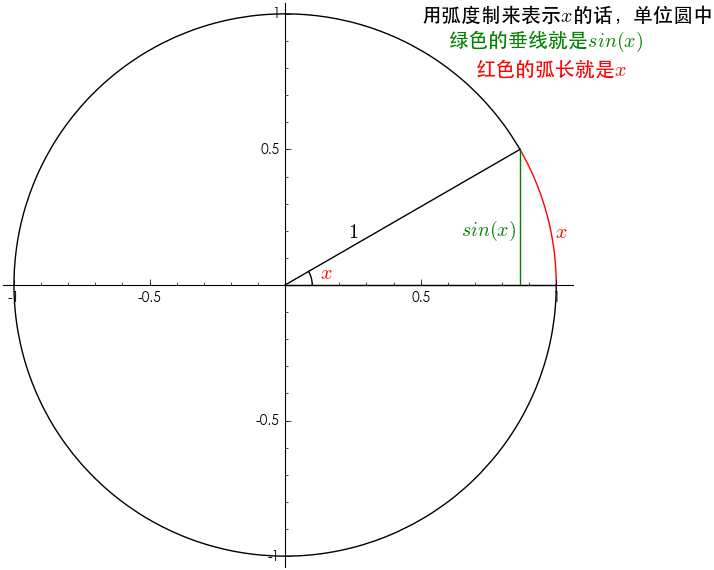
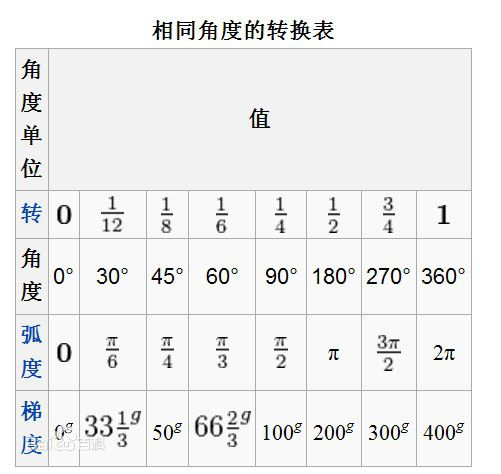
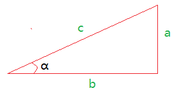
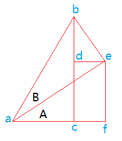

一个圆半径为R，一个角度的弧长也为R;

1弧度=$\frac{180}{\pi}$=$57.3\degree $
$1\degree$=$\frac{\pi}{180}$
一周弧度=$\frac{2\pi r}{r}$

---
#公式

##1.基本公式
$sin \alpha=\frac{a}{c}$

$cos \alpha=\frac{b}{c}$

$tan \alpha=\frac{a}{b}$

$sec \alpha=\frac{1}{sin\alpha}=\frac{c}{a}$

$csc \alpha=\frac{1}{cos\alpha}=\frac{c}{a}$

$cot \alpha=\frac{1}{tan\alpha}=\frac{b}{a}$

$tan \alpha=\frac{sin\alpha}{cos\alpha}$

$cot \alpha=\frac{cos\alpha}{sin\alpha}$
2.勾股定理:
$c^2=a^2+b^2$

3.$(sin\alpha)^2+(cos\alpha)^2=1$

推导：$(sin\alpha)^2+(cos\alpha)^2=(\frac{a}{c})^2+(\frac{b}{c})^2=\frac{a^2+b^2}{c^2}=\frac{c^2}{c^2}=1$

4.$(tan\alpha)^2+1=(sec\alpha)^2$
推导：
$(sin\alpha)^2+(cos\alpha)^2=1$ ---->

$\frac{(sin\alpha)^2}{(cos\alpha)^2}+\frac{(cos\alpha)^2}{(cos\alpha)^2}=\frac{1}{(cos\alpha)^2}$ ---->

$(tac\alpha)^2+1=(sec\alpha)^2$

4.

$sin(A+B)=sin AcosB+cosAsinB$
