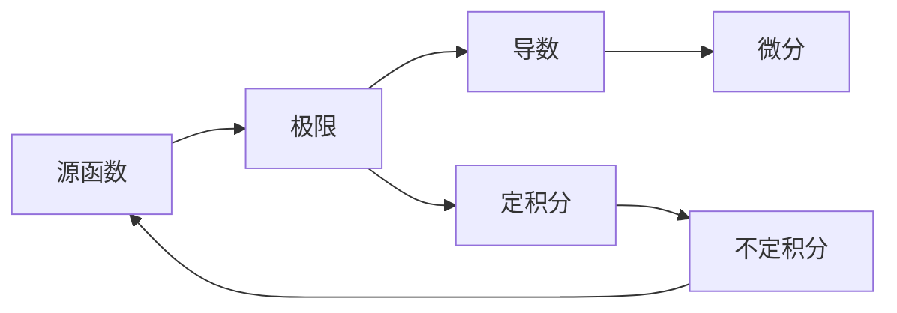

#知识关联
1. 如果f(x)在a点极限存在,那么f(a)点连续,那么可导；
2. 可导函数其实就是求极限的过程
3. 可导函数比是连续函数,连续的函数不一定都是可导

> 导数就是求极限的过程，然后总结出导数公式和导数法则，后面就可以根据这两个总结进行运算

#2

#定理
1. > ``介值定理``：如果f在[a,b]上``连续``，并且f(a)<0且f(b)>0,那么在区间(a,b)上至少有一点c,
使得f(c)=0。代之以f(a)>0且f(b)<0,同样成立
1. > ``最大值和最小值定理``:如果f在[a,b]上``连续``，那么f在[a,b]上至少有一个最大值和最小值

#导数部分
##导数
1. $\mathop{lim}\limits_{x\to x0}\frac{f(x) - f(x_0)}{x-x0}$
>如果x-x0$\rightarrow$0时的极限存在，则在x0处可导，并称这个极限为导数,记为$f^\prime(x0)$

>导数是极限，因此存在的充分必要条件是左右极限存在且相等
##导函数
>导函数:如果x在M区间上都可导,就构成一个新函数,导函数

##表现形式
比如f(x) = $x^2$

$f^\prime = \frac{dy}{dx} = \frac{d(x^2)}{dx} = \frac{d}{dx}(x^2) = 2x$

| a | b |
|---|---|
| > | 1 |
| 2 |   |

#1
dfsfddsf#1
mojombo/github-flavored-markdown#1
