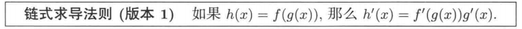

#极限
1. 夹逼定理

#基础知识
##有理函数

##不定式
$\frac{0}{0}$

#知识关联
1. 如果f(x)在a点极限存在,那么f(a)点连续,那么可导；
2. 可导函数其实就是求极限的过程
3. 可导函数比是连续函数,连续的函数不一定都是可导

> 导数就是求极限的过程，然后总结出导数公式和导数法则，后面就可以根据这两个总结进行运算

#2

#定理
1. > ``介值定理``：如果f在[a,b]上``连续``，并且f(a)<0且f(b)>0,那么在区间(a,b)上至少有一点c,
使得f(c)=0。代之以f(a)>0且f(b)<0,同样成立
1. > ``最大值和最小值定理``:如果f在[a,b]上``连续``，那么f在[a,b]上至少有一个最大值和最小值

-----
#导数部分
##导函数
1. $f^\prime(x)=\mathop{lim}\limits_{h\to0}\frac{f(x+h) - f(x)}{h}$
>其中h=$x-x_0$,从式子可以看出,导函数就是求极限,也叫导数
>如果极限不存在,则导数不存在
##函数不存在情况
1.函数连续间，有个不是滑顺而是尖的,这种情况导数左右极限不相等

##导数和连续性关系
>函数在x上可导，则在x上一定是连续的;
>反之,函数连续,并不一定可导

##导数法则及公式
###乘积法则

由上面知道,可以推广为n乘积
###商法则

###链式法则

##表现形式
比如f(x) = $x^2$

$f^\prime = \frac{dy}{dx} = \frac{d(x^2)}{dx} = \frac{d}{dx}(x^2) = 2x$

----

##积分、不定积分、定积分

积分：

不定积分：
定积分定义：

奇函数的定积分：$\int_{-a}^{a}f(x)dx=0$

###定积分性质
1. $\int_{a}^{b}f(x)dx$ = - $\int_{b}^{a}f(x)dx$

1. $\int_{a}^{a}f(x)dx$ = 0

1. $\int_{a}^{b}f(x)dx$ = $\int_{a}^{c}f(x)dx$ + $\int_{c}^{b}f(x)dx$

1. $\int_{b}^{a}Cf(x)dx$ = C$\int_{b}^{a}f(x)dx$

1. $\int_{a}^{b}(f(x)+g(x))dx$ = $\int_{a}^{b}f(x)dx$+$\int_{a}^{b}g(x)dx$

不定积分和定积分的区别？

#反常积分
##反常积分判定
1. 函数f在闭区间[a,b]内是无界的,a或b有垂直渐近线
1. b = $\infty$
1. a = -$\infty$

##闭区间的反常积分

1.在a点有垂直渐近线

2.在b点有垂直渐近线

3.在[a,b]中某个c点有垂直渐近线

注意:只有当这两部分的积分都收敛时,积分才收敛

上面3三情况计算方法：
根据上面的定义,先算出不定积分，然后再用极限求出值,根据值判定是否为反常积分

##无穷区间的反常积分
1.只有一个点是无穷

2.两个点都是无穷

求法:先在区间里选个c,然后分为两个部分,分别求收敛,两个都收敛则证明原来的是收敛的

##比较判别法
1.如果在区间(a,b)内,函数f(x)>=g(x)>=0,且积分$\int_{a}^{a}g(x)dx$是发散的,那么积分$\int_{a}^{a}f(x)dx$也是发散的

重点:该方法是用一个反常积分的结果去判别另个函数的反常积分
##极限比较判别法

##绝对收敛判别法
