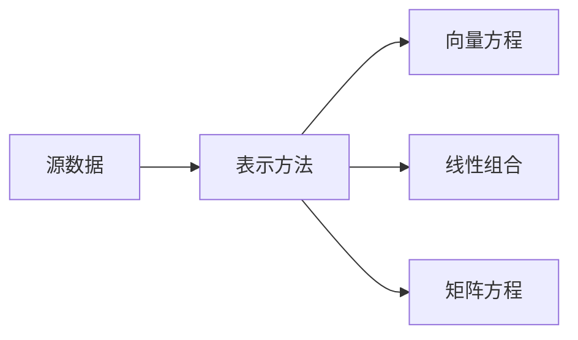
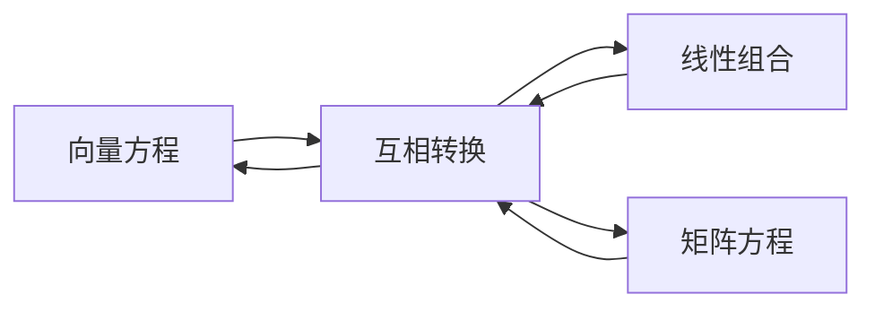

##向量方程
$x_1a_1+...+x_na_n=b$
$a_1...a_n$:向量
$x_1...x_n$:系数
##线性组合


##矩阵方程
Ax=b
A=矩阵，x、b向量


>```重点:```把线性组合看做矩阵和向量的积

##线性无关


#线性变换
Ax=b
可以看做一个函数,x的向量经过A变换后，得到一个b向量，和函数是一样的

##矩阵乘法的性质
社A为m x n矩阵

##矩阵转置$A^T$
定义：给定m x n矩阵A,则A的转置是一个n x m矩阵，用$A^T$表示
公式：设A与B为矩阵
1. $(A^T)^T=A$
1. $(A+B)^T=A^T+B^T$
1. $(rA)^T=rA^T$,任意数r
1. $(ABC)^T=C^TB^TA^T$,推广到n个矩阵，顺序相反
##矩阵的逆$A^{-1}$
I为单位矩阵
1. $AA^{-1}=I$,$A^{-1}A=I$

>``定理1``：设$A=
\begin{bmatrix}a & b\\
c & d\end{bmatrix}$,若$ad-bc\neq0$,则A可逆且$A^{-1}=\frac{1}{ad-bc}\begin{bmatrix}d & -b\\
-c & a\end{bmatrix}$

>``定理2``:若A是可逆的n x n矩阵，则对每一个$R^n$中的b,方程Ax=b有唯一解x=$A^{-1}b$
