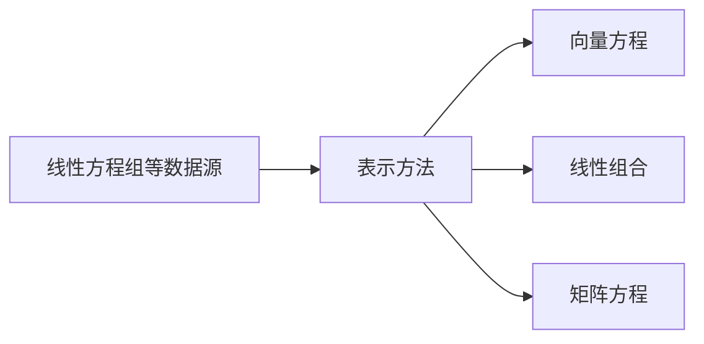
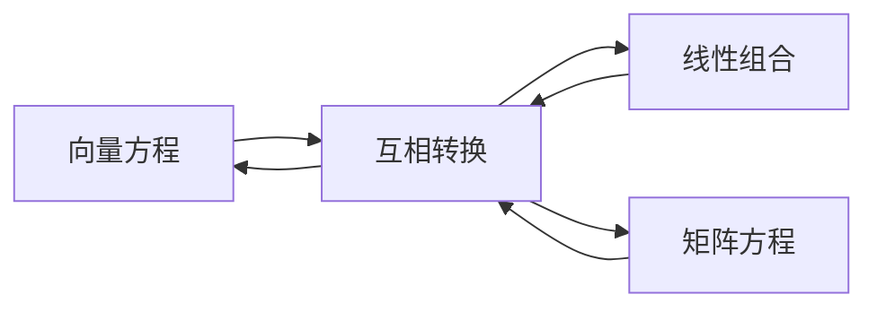

#需要掌握的知识点
- [x] 线性无关和相关
- [x] 子空间
  - [x] 矩阵的零空间 复习
- [x] 基变换

---





```mermaid
graph LR
  Ax=b求解 --> 唯一解
  唯一解 --> 线性无关
  Ax=b求解 --> 多解
  多解 --> 线性相关
  Ax=b求解 --> 无解

```


---
#矩阵的运算
###加减法
A + B = B + A
###乘法
A * B 不一定等于 B * A
A * I = I * A = A (I为单位矩阵, 前提A为n * n矩阵)
### 矩阵的逆
前提：A为n * n矩阵
$A^{-1}A$ = $AA^{-1}$ = 单位矩阵I


---

定理：每个矩阵只有一个简化阶梯形矩阵

#向量空间
>``向量空间``：数学其他领域也有加法和标量乘法,这些一样的运输规则，可以抽象为向量空间,然后用线性代数运算  

##向量空间公理:

##线性方程组
2x+3y=5
总结:$a_1x_1+a_2x_2+...+a_nx_n=b$,a就是实数，x就是未知变量


##向量方程
$x_1a_1+...+x_na_n=b$
$a_1...a_n$:向量
$x_1...x_n$:系数
##线性组合


##矩阵方程
Ax=b
A=矩阵，x、b向量


>```重点:```把线性组合看做矩阵和向量的积

##线性无关
判断方法:Ax=0的A矩阵通过增广矩阵行变换时,各列都有一个主元,那么就是线性无关

###标准矩阵

#线性变换
Ax=b
可以看做一个函数,标准基下的x向量经过A变换后，得到一个在A的坐标空间的b向量，和函数是一样的

##矩阵乘法的性质
社A为m x n矩阵

##矩阵转置$A^T$
定义：给定m x n矩阵A,则A的转置是一个n x m矩阵，用$A^T$表示
公式：设A与B为矩阵
1. $(A^T)^T=A$
1. $(A+B)^T=A^T+B^T$
1. $(rA)^T=rA^T$,任意数r
1. $(ABC)^T=C^TB^TA^T$,推广到n个矩阵，顺序相反
1. $A^TA=$对称矩阵
1. 对称矩阵$^T$=对称矩阵
##矩阵的逆$A^{-1}$
I为单位矩阵
1. $AA^{-1}=I$,$A^{-1}A=I$  
1. $Ax = b,x=A^{-1}b$

>``定理1``：设$A=
\begin{bmatrix}a & b\\
c & d\end{bmatrix}$,若$ad-bc\neq0$,则A可逆且$A^{-1}=\frac{1}{ad-bc}\begin{bmatrix}d & -b\\
-c & a\end{bmatrix}$

>``定理2``:若A是可逆的n x n矩阵，则对每一个$R^n$中的b,方程Ax=b有唯一解x=$A^{-1}b$

>``唯一性和线性无关``：若A可逆,则A所有的列向量是线性无关的;那么Ax=b,x对应唯一的b解,反之也成立;零空间只有唯一的解零向量;  

>``可逆矩阵 = 单位矩阵``
---
#<font color=red>四个子空间</font>
##子空间成立条件
>子空间是$R^n$的一个向量集合,只要满足以下三个条件就是子空间
1.子空间一定含有零向量
2.加法封闭性:子空间里的任意向量u和v,u+v属于子空间
3.乘法封闭性:子空间任意向量u和实数c,cu属于子空间
##表示
span(a、b...n),表示子空间,由a、b..n向量线性组合合成,当a、b..n线性无关时,a、b..n也可表示为基

#1.矩阵的零空间
Ax = 0，所有满足前面方程的x集合，成为零空间，表示为``Nul A``
>零空间的维数：矩阵简化梯形后,自由变量的个数就是零空间的维数

#2.列空间

#3.行空间

#4.行零空间


#重要关系结论
1. 行空间和列空间有相同的维数
1. 行空间和列空间的基一样
---
#基变换
>``基变换是什么？``:在$R^n$中除了标准基之外，还存在许多基,有时在标准基计算下,会比较麻烦，为了方便，
可以转换为其他基下面换算，再转回原来的矩阵，这时就需要基变换了  

>``转移矩阵``:有另个B基为$(1,2)^T,(3,4)^T$,则可变为如$\begin{bmatrix}1 & 3\\2 & 4\end{bmatrix}$的转移矩阵，主要
是从B基转换为标准基，转移矩阵的逆才能从标准基转换为B基

#标准正交基
1. 所有基向量长度都是1
2. 所有基向量互相垂直


---
##名词解释
>``列向量``：就是矩阵的一列的向量  
>``列空间``：一个矩阵的列向量的线性组合  
>``列空间的维数或秩``:维数就是基底向量的个数
>``基底向量``:矩阵中线性无关的向量,它是被包含在列向量里的；矩阵通过简化后,有主元的列向量就基底向量

###求特征向量
Av=$\lambda{v} --> Av-\lambda{v}=0-->(\lambda{I}-A)v=0$
求$(\lambda{I}-A)$的行列式为0,就求出了特征向量

1.Ax=$\lambda{x}$,By=$\lambda{y}$,则A+b和AB都是另个矩阵

>``1``:一个矩阵是线性无关的，那么它其实最后可以简化为单位矩阵，每次梯形简化就是一次矩阵相乘


#特征向量和特征值
$A^nx=b$当有这种计算时,如果存在特征向量则会简化计算


---
#向量性质
##点积
>``定理1``:设a、b和w是$R^n$空间的的向量，t是一个数  
1.$a\bullet{b} = b\bullet{a}$
2.$(a+b)\bullet{c}=a\bullet{c}+b\bullet{c}$
3.$(ta)\bullet{b}=t(a\bullet b)=a(t\bullet b)$
4.$a\bullet a\geqslant 0$,并且$a\bullet a=0$成立的充分必要条件是a=0


##向量的长度
>``定义``:向量v的长度是非负数$\|a\|$，则$\|a\|=\sqrt{a\bullet a}$,且$\|a\|^2=a\bullet a$
>``定义原理``:想象二维、三维的勾股定理，可以把这个推广到n维
>``单位化``:$u=\frac{1}{\|a\|}a$,用该公式就可以计算出a长度为1的单位向量

##$R^n$的向量间距离
>``定义``:$R^n$中向量a和b的距离，记做dis(a,b),表示向量a-b的长度，即dist(a,b)=$\|a-b\|$

##正交
>``正交性``:当$a\bullet b$=0时,表示a和b向量互相垂直
>定理:向量正交的充分必要条件是$\|a+b\|^2=\|a\|^2+\|b\|^2$

##$R^2,R^3$的角度
>``公式``:$a\bullet b=\|a\|\bullet \|b\|cos \theta$


#杂记
>多向量加法的数学本质，实际上是这些向量在坐标轴上（以 0 点为坐标原点的坐标系）的投影
（或坐标分量）的合成（相加或相减）后的结果。
向量的更高一级的运算如点积、叉积的定义也是
这个数学本质的体现。
