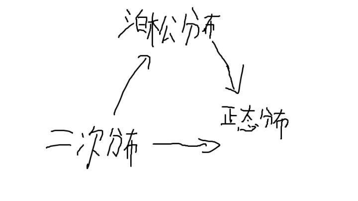

大数定理---->概率
coursera
#基本概念
###基本事件
>``基本事件``:投一次骰子只能有6种结果,分别是{1、2、3、4、5、6},就叫做基本事件
>``事件``:比如扔一次硬币的基本事件是{正面H,反面F},扔2次的由基本事件组合而成的叫事件,分别是
{HH,HF,FH,FF},可以把2次扩展为n次,各个事件相加为1

#概率公式
##全概率公式
https://blog.csdn.net/qq_33638791/article/details/52496516

##贝叶斯公式
作用：解决逆向概率问题

#概率类型
##正向概率
>正向概率:假设袋子里面有N个白球，M个黑球，你伸手进去摸一把，摸出黑球的概率是多大

##逆向概率
>逆向概率:如果我们事先并不知道袋子里面黑白球的比例，而是闭眼睛摸出一个球，观察这些取出来的颜色之后，那么我们可以就此对袋子里面的黑白球的比例做出什么样的推测
<<<<<<< HEAD
#术语
>前提条件：扔硬币可能性为{正面、反面}
>事件：发生的各种可能性
>试验：对事件的确认
>基本事件：事件= 基本事件+基本事件
>总结：比如扔硬币在没扔前的可能性为{正面、反面},而这种就是事件;然后到底是不是这样呢,就要进行真正的实验,这就是试验

>随机事件：不确定性,在(0,1)
>必然事件,不可能事件：1,0

>条件概率：P(A|B),在B条件下,A发生的概率
=======

#样本空间概念
试验结果：一个试验可能产生的结果叫试验结果,每个试验结果必是互斥
试验：每次试验只能产生一个试验结果
事件：是试验结果集合
样本空间：互斥的事件组合成样本空间,想象成切蛋糕
>>>>>>> 77f158ebecc6ec88b8555de8e2a1c99ae403c497
