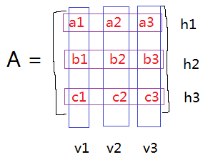
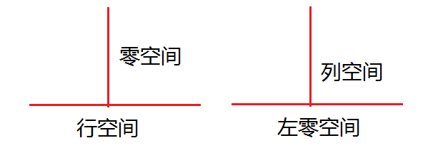

线性无关/相关
基->标准基->坐标系->坐标向量->坐标变换
向量空间->子空间:列空间、零空间、行空间、左零空间
线性变换、坐标映射

#知识联系
线性变换：x从Rn变换为Rm
坐标映射：x从Rn变换为Rn,线性变换的特例,注意得是一一映射,那么矩阵就是可逆

#Ax的理解

x =[x1  x2  x3]
理解一：Ax = v1x1 + v2x2 + v3x3
表示为A的列线性组合

理解二：Ax = [h1x1  h2x2  h3x3]
表示为x与A的行内积

理解三:
一般x可以当做默认标准基的坐标向量,矩阵A为从标准基转换为A里的基的坐标转换

理解四：Ax=b
x有解,只有当b是A列空间的线性组合;但是x的所有解集合不构成向量空间,因为不包含零向量

#Ax=b求解
列满秩r=n时,x一一映射b,无解 or 唯一解

行满秩:r=m<n，x一定能映射b,n个x解

满秩r=n=m:x唯一映射b

r<n and r<m:无解 or 多个解

#向量空间

##子空间
列空间和零空间关系？
列空间 表示：Col A,矩阵的主元列构成ColA的一个基
零空间 表示：Nul A,Ax中的x是属于零空间内的线性组合
A是m*n矩阵

Col A基 + Nul A基 = n

两个子空间的交集,仍未子空间.

#$A^T$A=对称矩阵
>定理1：
N($A^T$A) = N(A)
解读:A的零空间是等于($A^T$A)矩阵的零空间的

>定理2：
Rank $A^T$A = Rank A
解读:两边的秩是一样的,从而可以从这里这里快速判断出$A^T$A是否可逆矩阵
