#正交性
##$R^n$的正交性
1. $R^n$的长度

2. 柯西-施瓦瓷不等式

##子空间的正交性
1. 正交补
>定义:令Y为$R^n$的子空间,$R^n$中所以与Y中的每一个向量正交的向量集合记为$Y^\bot$

公式:Y + $Y^\bot$ = $R^n$

2. 基本子空间
>定理：若A为m * n矩阵,则N(A)=$R(A^T)^\bot$,且$N(A^T)=R(A)^\bot$

3. 正交集
>正交基:互相正交,但不是每个向量都是长度为1

4. 正交投影

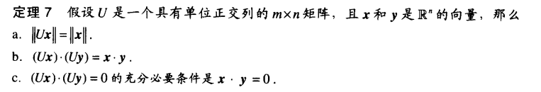
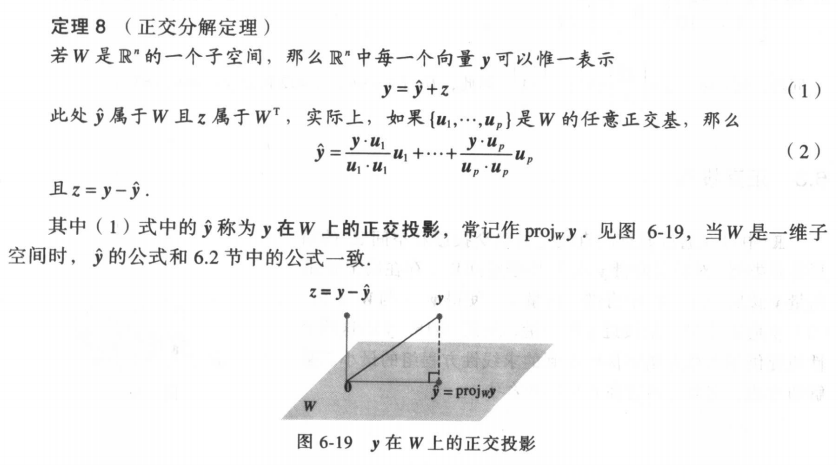
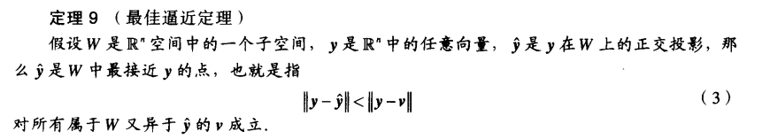
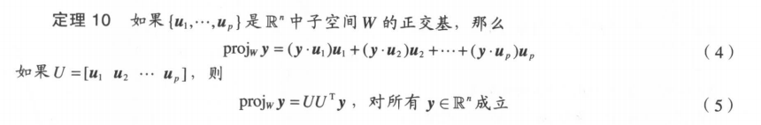
>正交矩阵：为一个方正,且列向量都是一个个单位正交基,所以$U^{-1}=U^T$

#特征值和特征向量
##寻找特征值和特征向量
1.
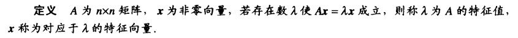

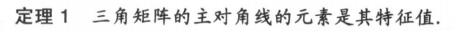

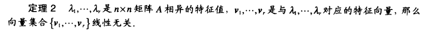
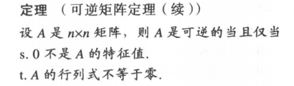
1. 特征方程
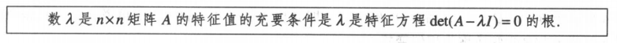

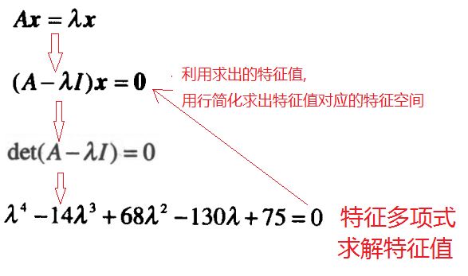

2. 相式性

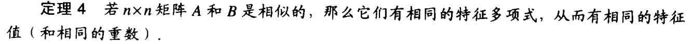

3. 对角化
>分解式
A=$PDP^{-1}$
P：矩阵的每列由特征向量组成
D:方正矩阵的对角表示为特征值
作用：$A^k$时,分解式可以容易计算
$A^k=PD^KP^{-1}$

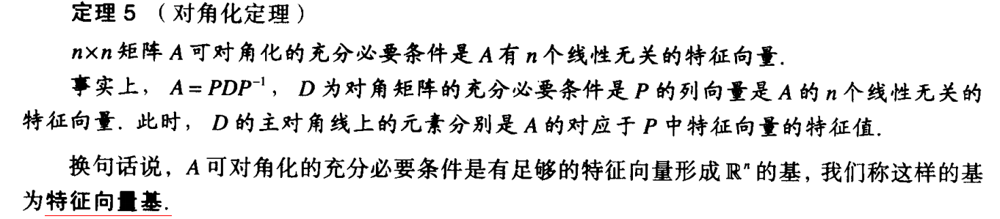

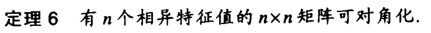
>当特征值不是相异时,也能形成对角化
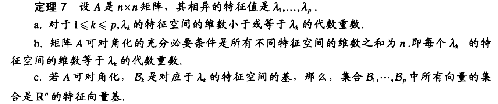

9. 如何应用特征
>0. 求$A^kX0$？
>1. 先用det(A-$\lambda$I)=0,求解出特征值
>2. 然后用求到的特征值,代入(A-$\lambda$I)x=0,求出(A-$\lambda$I)的零空间,零空间就是该特征值的特征空间
>3. 求到特征值和特征空间后, 把值代入$PDP^{-1}$
>4. 因为有了特征向量组成的特征向量基,那么可以把X0用特征向量基表示
