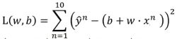

监督学习就是你做卷子，做完以后给你正确答案你可以对答案，从而得出获得正确答案的方法。

非监督学习就是只给你一堆题，你做的题多了，自然也能判断出获得正确答案的规律。

监督学习多用于回归分析（求解是连续值，比如某一区间）和分类问题（求解是离散值，比如对错）。非监督学习初步多用于聚类算法（群分析）

##梯度下降
五步解析机器学习难点—梯度下降：
https://zhuanlan.zhihu.com/p/27297638

通俗易懂了解机器学习中的“回归”和“梯度下降方法”（一）
https://zhuanlan.zhihu.com/p/30759359
通俗易懂了解机器学习中的“回归”和“梯度下降方法”（二）
https://zhuanlan.zhihu.com/p/

损失函数：

