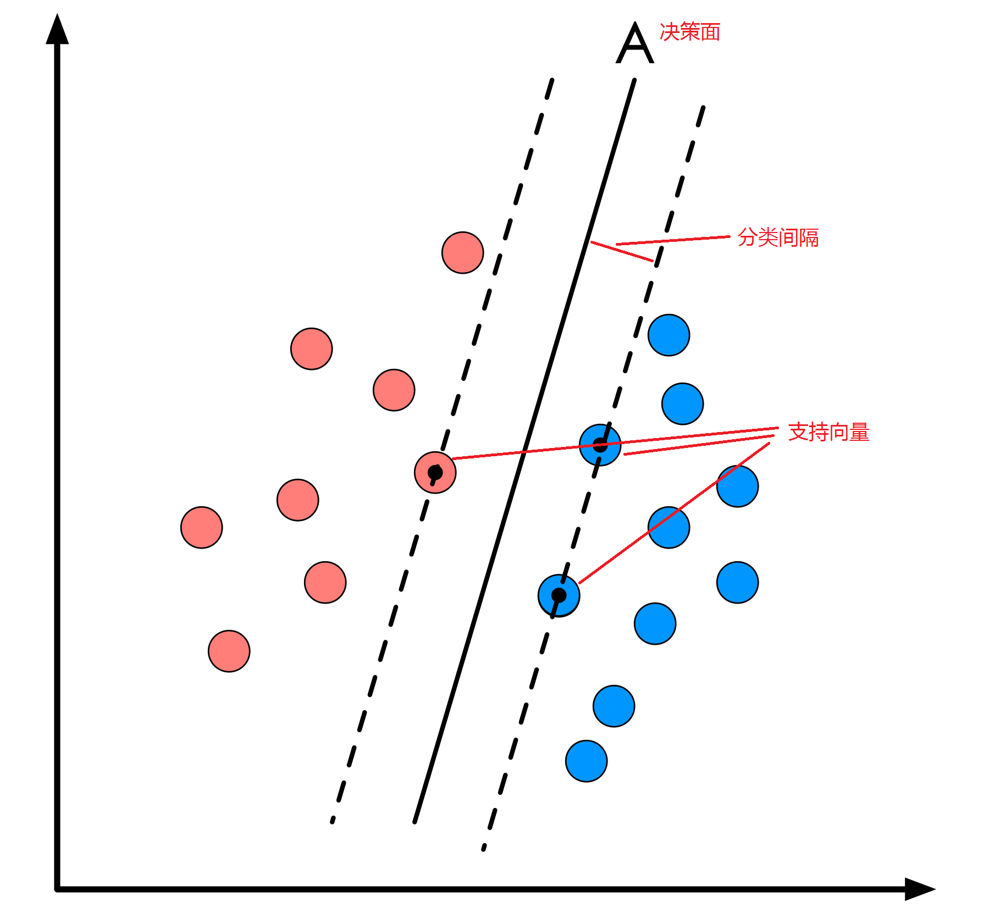
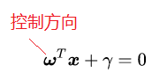

---

#中英对应
1. 支持向量   =  support voctor

#预备知识
###超平面

###支持向量

#公式推导
>超平面:
>$\omega^Tx + b = 0$

>点到超平面的距离：
>$c=\frac{|\omega^Tx + b|}{|\omega|}$

>分类间隔:
>设支持向量到最优决策面距离为d,则分类间隔为：
>w = 2d

>把样本点分类：
>$\omega^Tx + b > 0$,y=+1
>$\omega^Tx + b < 0$,y=-1
>因为$\omega$、x都是n维,当这些样本点得出的值表示的是n+1维中,样本点到n维超平面的距离;

>函数间隔：
>$r^1=y*(\omega^Tx + b$)>0
>当样本点分类正确时,r是正值;
效果：函数间隔越大分类效果越好
>缺点：
>1.当$\omega$、x乘上某个数时,超平面在n+1维中位置和方向不动;
>2.因为不管乘上什么数,超平面最后都是等于0:  a*$(\omega^Tx + b) = 0$
>3.但是样本点的距离变大了乘上数的a倍

>几何间隔：
>作用：解决函数间隔的缺点
>$r=\frac{y*(\omega^Tx + b)}{|\omega|}$
>除以$|\omega|$后,原本变大几倍的距离,会也会被除以几倍保持稳定,这个公式等于$d=\frac{|\omega^Tx + b|}{|\omega|}$

>d维支持向量到最优决策面,于是下面式子成立:
>$\frac{\omega^Tx + b}{||\omega||}\geq$d
>$\frac{\omega^Tx + b}{||\omega||}\leq$-d
>不等式的两边同时除以距离ds
