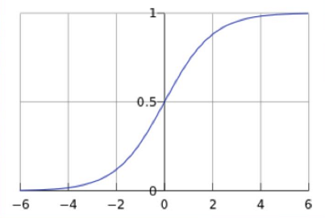

#sigmoid函数介绍
1. sigmoid函数图

>sigmoid函数表达式:
>$y=\frac{1}{1+e^{-z}}$

>选这个函数原因：可微 and 单调
>y的值可以当做一个[0,1]之间的概率值

#数学公式推导

>由
>$z=w^T+b$

>1.代入以下公式
>$y=\frac{1}{1+e^{-z}}$

>得到:
$y=\frac{1}{1+e^{-(w^T+b)}}$

>2.两边同时倒数：
$\frac{1}{y}=1+e^{-(w^T+b)}$

> 把右边的1挪到左边：
$\frac{1-y}{y}=e^{-(w^T+b)}$

>3.求对数
$ln\frac{y}{1-y}=w^T+b$
>
>>现在将 y 视作 x 为正例的可能性（也就是视作为“1”类可能性）
反之将 1 - y 视作 x 为反例的可能性（也就是视作为“0”类可能性）

>4.把y当做表示为概率p时
$ln\frac{p}{1-p}=w^T+b$

>5.p表示为在x当前提的条件概率是多少
>表示为1标签的概率为： p = p(Y=1|x)
>表示为0标签的概率为：1 - p = p(Y=0|x)
>代入4中得
$ln\frac{p(Y=1|x)}{p(Y=0|x)}=w^T+b$

#逻辑回归的损失函数（Loss Function）
>损失函数:用来衡量模型的输出与真实输出的差别。

>我们把单个样本看做一个事件，那么这个事件发生的概率就是：

>等价于:

>当N个样本, 相乘就总概率得：

>乘很复杂，我们通过两边取对数来把连乘变成连加的形式，即：

>这个函数 [公式] 又叫做它的损失函数。损失函数可以理解成衡量我们当前的模型的输出结果，跟实际的输出结果之间的差距的一种函数。这里的损失函数的值等于事件发生的总概率，我们希望它越大越好。但是跟损失的含义有点儿违背，因此也可以在前面取个负号。

>最大似然估计:求F的最大值,就是求怎么让各个样本的概率相乘,得到F的值最大;
可以理解成,如果有5个红球,3个黑球,那么在摸10次球时,那么摸到红球的概率
