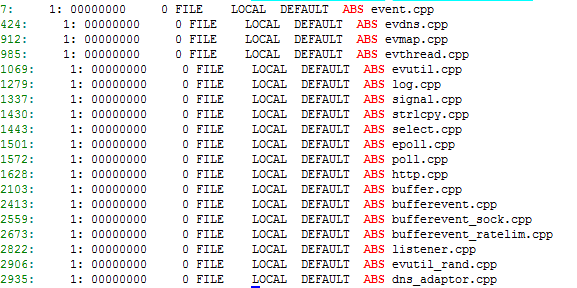

#汇编阶段
##预编译
1. 编译指令
gcc -E {input file} -o {output file}.i

>作用:
1. 导入#include
1. #define 替换
1. #if、#elif

##语法分析

##汇编
这个阶段编成与平台相关的汇编指令

>编译指令:gcc -S test.c -o test.s

##翻译二进制
>编译指令:gcc -c test.c -o test.o

#链接
##Relocation
把各个.o拼成同一个虚拟内存空间
##引用
>.o之间会互相引用对方的函数,这时就需要找到引用的具体实现

#查看静态库
1. 查看包含.o文件
>readelf -s libevent_dns.a | grep -n ABS

