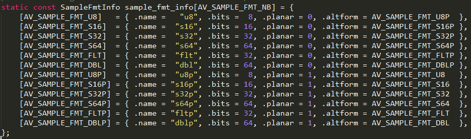

enum AVSampleFormat
{
    AV_SAMPLE_FMT_NONE = -1,
    AV_SAMPLE_FMT_U8,          ///< unsigned 8 bits
    AV_SAMPLE_FMT_S16,         ///< signed 16 bits
    AV_SAMPLE_FMT_S32,         ///< signed 32 bits
    AV_SAMPLE_FMT_FLT,         ///< float
    AV_SAMPLE_FMT_DBL,         ///< double
    AV_SAMPLE_FMT_U8P,         ///< unsigned 8 bits, planar
    AV_SAMPLE_FMT_S16P,        ///< signed 16 bits, planar
    AV_SAMPLE_FMT_S32P,        ///< signed 32 bits, planar
    AV_SAMPLE_FMT_FLTP,        ///< float, planar
    AV_SAMPLE_FMT_DBLP,        ///< double, planar
    AV_SAMPLE_FMT_S64,         ///< signed 64 bits
    AV_SAMPLE_FMT_S64P,        ///< signed 64 bits, planar
    AV_SAMPLE_FMT_NB           ///< Number of sample formats. DO NOT USE if linking dynamically
}

int av_get_bytes_per_sample(enum AVSampleFormat sample_fmt)
说明:获取该sample_fmt对应的字节数

大小=采样数×每个采样的大小×通道数

 * For planar sample formats, each audio channel is in a separate data plane,
 * and linesize is the buffer size, in bytes, for a single plane. All data
 * planes must be the same size. For packed sample formats, only the first data
 * plane is used, and samples for each channel are interleaved. In this case,
 * linesize is the buffer size, in bytes, for the 1 plane.

这解释了音频smaple_fmt中什么是planar，什么是packed。

1：无论是不是分片的数据总量是相同的.
2：分片的存储在内存中linesize如果两声道则左右分开占用linesize[0]和linesize[1].
3：不是分片的存储在内存中两声道不分开，左右左右....这样存储，只占用linesize[0].

mp3的sample是1152,aac是1024

1) AAC:
nb_samples和frame_size = 1024
一帧数据量：1024*2*av_get_bytes_per_sample(s16) = 4096个字节。
会编码：88200/(1024*2*av_get_bytes_per_sample(s16)) = 21.5帧数据
2) MP3:
nb_samples和frame_size = 1152
一帧数据量：1152*2*av_get_bytes_per_sample(s16) = 4608个字节。
MP3:则会编码：88200/(1152*2*av_get_bytes_per_sample(s16)) = 19.1帧数据

3:持续时间方面
1) AAC
音频帧的播放时间=一个AAC帧对应的采样样本的个数/采样频率(单位为s)
一帧 1024个 sample。采样率 Samplerate 44100KHz，每秒44100个sample, 所以根据公式   音频帧的播放时间=一个AAC帧对应的采样样本的个数/采样频率
当前AAC一帧的播放时间是= 1024*1000000/44100= 22.2ms(单位为ms)

2) MP3
mp3 每帧均为1152个字节， 则：
frame_duration = 1152 * 1000000 / sample_rate
例如：sample_rate = 44100HZ时，计算出的时长为26.122ms，这就是经常听到的mp3每帧播放时间固定为26ms的由来

1024 / 44100 = 1115 / 480000
